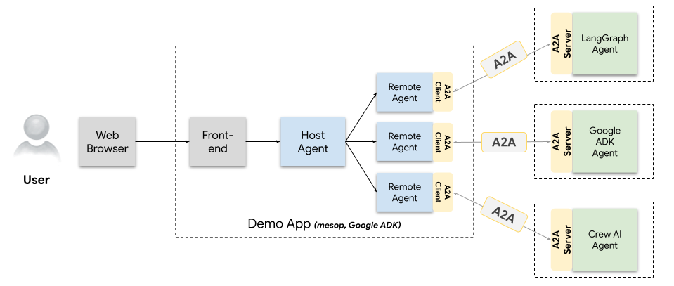

  

  <a href="README.zh-CN.md">中文</a> | <b>English</b>

# BitSpirit A2A Project agent-client-multiple-web Frontend

- Developed with Ant Design (React)

## A2A Protocol Architecture

- [A2A Protocol Introduction](https://developers.googleblog.com/zh-hans/a2a-a-new-era-of-agent-interoperability/)
- [Google A2A GitHub](https://github.com/google/A2A)
- [Spring AI](https://github.com/spring-projects/spring-ai)

- The "Front-End" in the diagram refers to this project.

### 📝 Feedback & Contribution
If you find any issues or bugs during use, you are welcome to provide valuable feedback. You can participate in the project by submitting issues or pull requests.

## License
This project is licensed under the Apache License 2.0. See the [LICENSE](LICENSE) file for details.